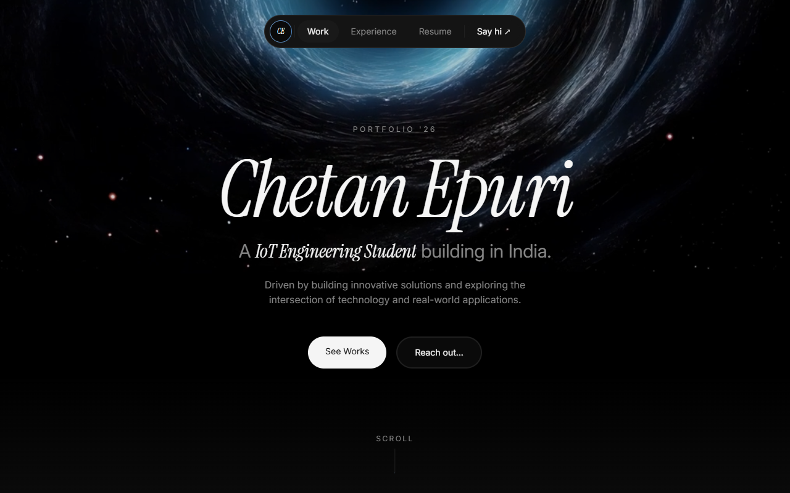

<div align="center">
  

  # 🌌 Chetan Epuri - Personal Portfolio
  
  **An immersive, cosmic-themed personal portfolio built with React & Framer Motion.**

  [](https://chetanepuri.github.io/)
  [](https://react.dev/)
  [](https://vitejs.dev/)
  [](https://tailwindcss.com/)
</div>

---

## 🚀 Overview

Welcome to the source code for my personal portfolio. Designed to be more than just a resume, this space serves as an immersive digital experience utilizing fluid animations, cosmic aesthetics, and modern web architecture.

## ✨ Key Features

- **Immersive Video Backgrounds**: High-performance HTTP Live Streaming (HLS.js) backgrounds powered by Mux.
- **Fluid Animations**: Smooth page transitions and micro-interactions orchestrated via `framer-motion` and `GSAP`.
- **Glassmorphism UI**: Beautiful, translucent glass surfaces layered dynamically over cosmic backgrounds.
- **Custom Loading Screen**: An engaging, animated intro sequence that seamlessly transitions into the application.
- **Client-Side Routing**: Fast and snappy navigation powered by React Router.

## 🛠️ Technology Stack

- **Core**: React 19, TypeScript, Vite
- **Styling**: Tailwind CSS v4, PostCSS
- **Animation**: Framer Motion, GSAP
- **Media**: HLS.js (for adaptive bitrate video streaming)
- **Icons**: Lucide React

## 📦 Local Development

Want to spin this up locally? 

1. **Clone the repository:**
   ```bash
   git clone https://github.com/ChetanEpuri/ChetanEpuri.github.io.git
   cd ChetanEpuri.github.io
   ```

2. **Install dependencies:**
   ```bash
   npm install
   ```

3. **Start the development server:**
   ```bash
   npm run dev
   ```

## 🌐 Deployment

This project is automatically deployed to GitHub Pages. The source code lives on the `main` branch, and the build pipeline handles compiling the Vite application for production viewing.

---
<div align="center">
  <p><i>Crafted with passion, code, and caffeine.</i></p>
</div>
